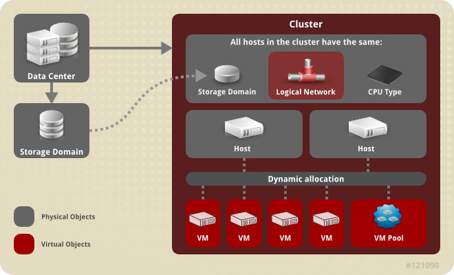

# Introduction to Clusters

A cluster is a logical grouping of hosts that share the same storage domains and have the same type of CPU (either Intel or AMD). If the hosts have different generations of CPU models, they use only the features present in all models.

Each cluster in the system must belong to a data center, and each host in the system must belong to a cluster. Virtual machines are dynamically allocated to any host in a cluster and can be migrated between them, according to policies defined on the **Clusters** tab and in the Configuration tool during runtime. The cluster is the highest level at which power and load-sharing policies can be defined.

The number of hosts and number of virtual machines that belong to a cluster are displayed in the results list under **Host Count** and **VM Count**, respectively.

Clusters run virtual machines or Red Hat Gluster Storage Servers. These two purposes are mutually exclusive: A single cluster cannot support virtualization and storage hosts together.

Red Hat Virtualization creates a default cluster in the default data center during installation.

**Cluster**

