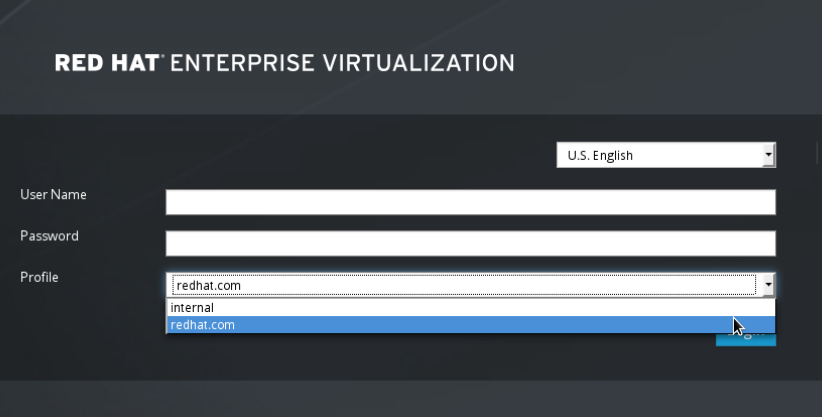

# Configuring an External LDAP Provider (Interactive Setup)

The `ovirt-engine-extension-aaa-ldap` extension allows users to customize their external directory setup easily. The `ovirt-engine-extension-aaa-ldap` extension supports many different LDAP server types, and an interactive setup script is provided to assist you with the setup for most LDAP types.

If the LDAP server type is not listed in the interactive setup script, or you want to do more customization, you can manually edit the configuration files. See [Configuring an External LDAP Provider ManualMethod](Configuring_an_External_LDAP_Provider_ManualMethod) for more information.

For an Active Directory example, see [Attaching an Active Directory](Attaching_an_Active_Directory).

**Prerequisites:**

* You need to know the domain name of the DNS or the LDAP server. Round-robin and failover policies are also supported.

* To set up secure connection between the LDAP server and the Manager, ensure a PEM-encoded CA certificate has been prepared. See [Setting Up SSL or TLS Connections between the Manager and an LDAP Server](Setting_Up_SSL_or_TLS_Connections_between_the_Manager_and_an_LDAP_Server) for more information.

* Unless anonymous search is supported, a user with permissions to browse all users and groups must be available on the directory server to be used as the search user. Note down the search user's distinguished name (DN). Do not use the administrative user for the directory server.

* Have at least one set of account name and password ready to perform search and login queries to the LDAP server.

**Configuring an External LDAP Provider**

1. On the Red Hat Virtualization Manager, install the LDAP extension package:

        # yum install ovirt-engine-extension-aaa-ldap-setup

2. Run `ovirt-engine-extension-aaa-ldap-setup` to start the interactive setup: 

        # ovirt-engine-extension-aaa-ldap-setup

3. Specify a profile name. The profile name is visible to users on the login page. This example uses `redhat.com`.

    **Note:** To rename the profile after the domain has been configured, edit the `ovirt.engine.aaa.authn.profile.name` attribute in the `/etc/ovirt-engine/extensions.d/redhat.com-authn.properties` file. Restart the engine service for the changes to take effect.

        Please specify profile name that will be visible to users:redhat.com

    **The Administration Portal Login Page**

    

    **Note:** Users need to select the desired profile from the drop-down list when logging in for the first time. The information is then stored in browser cookies and preselected the next time the user logs in.

4. Select an LDAP type by entering the corresponding number. If you are not sure which schema your LDAP server is, select the standard schema of your LDAP server type. For Active Directory, follow the procedure at [Attaching an Active Directory](Attaching_an_Active_Directory).

        Available LDAP implementations:
        1 - 389ds
        2 - 389ds RFC-2307 Schema
        3 - Active Directory
        4 - IPA
        5 - Novell eDirectory RFC-2307 Schema
        6 - OpenLDAP RFC-2307 Schema
        7 - OpenLDAP Standard Schema
        8 - Oracle Unified Directory RFC-2307 Schema
        9 - RFC-2307 Schema (Generic)
        10 - RHDS
        11 - RHDS RFC-2307 Schema
        12 - iPlanet
        Please select: 10

5. Press **Enter** to accept the default and configure domain name resolution for your LDAP server name:

        It is highly recommended to use DNS resolution for LDAP server.
        If for some reason you intend to use hosts or plain address disable DNS usage.
        Use DNS (Yes, No) [Yes]: 

6. Select a DNS policy method by entering the corresponding number:

        1 - Single server
        2 - DNS domain LDAP SRV record
        3 - Round-robin between multiple hosts
        4 - Failover between multiple hosts
        Please select:

    * For option 1, the DNS servers listed in `/etc/resolv.conf` is used to resolve the IP address. Ensure the `/etc/resolv.conf` file is updated with the correct DNS servers.

        Enter the fully qualified domain name (FQDN) or the IP address of the LDAP server. You can use the `dig` command with the SRV record to find out the domain name. An SRV record takes the following format:  `_service._protocol.domain name`. For example: `dig _ldap._tcp.redhat.com SRV`.

    * For option 2, enter the domain name of the DNS server. A DNS search is performed to look up the SRV records to find out the domain name of the LDAP server.

    * For option 3, enter a space-separated list of LDAP servers. Use either the FQDN or IP address of the servers. This policy provides load-balancing between the LDAP servers. Queries are distributed among all LDAP servers according to the round-robin algorithm.

    * For option 4, enter a space-separated list of LDAP servers. Use either the FQDN or IP address of the servers. This policy defines the first LDAP server to be the default LDAP server to respond to queries. If the first server is not available, the query will go to the next LDAP server on the list.

7. Select the secure connection method your LDAP server supports and specify the method to obtain a PEM-encoded CA certificate. The file option allows you to provide the full path to the certificate. The URL option allows you to specify a URL to the certificate. Use the inline option to paste the content of the certificate in the terminal. The system option allows you to specify the default location for all CA files. If the insecure mode is selected, the connection is still encrypted using TLS but certificate validation is skipped.

        NOTE:
        It is highly recommended to use secure protocol to access the LDAP server.
        Protocol startTLS is the standard recommended method to do so.
        Only in cases in which the startTLS is not supported, fallback to non standard ldaps protocol.
        Use plain for test environments only.
        Please select protocol to use (startTLS, ldaps, plain) [startTLS]: startTLS
        Please select method to obtain PEM encoded CA certificate (File, URL, Inline, System, Insecure): File
        Please enter the password:

    **Note:** LDAPS stands for Lightweight Directory Access Protocol Over Secure Socket Links. For SSL connections, select the `ldaps` option.

    For more information on creating a PEM-encoded CA certificate, see [Setting Up SSL or TLS Connections between the Manager and an LDAP Server](Setting_Up_SSL_or_TLS_Connections_between_the_Manager_and_an_LDAP_Server).

8. Enter the search user distinguished name (DN). The user must have permissions to browse all users and groups on the directory server. The search user must be specified in LDAP annotation. If anonymous search is allowed, press **Enter** without any input.

        Enter search user DN (empty for anonymous): uid=user1,ou=Users,dc=test,dc=redhat,dc=com
        Enter search user password:

9. Test the search and login function to ensure the your LDAP server is connected to your Red Hat Virtualization environment properly. For the login query, enter the account name and password. For the search query, select `Principal` for user accounts, and select `Group` for group accounts. Enter `Yes` to `Resolve Groups` if you want the group account information for the user account to be returned. Select `Done` to complete the setup. Three configuration files are created and displayed in the screen output.

        NOTE:
        It is highly recommended to test drive the configuration before applying it into engine.
        Perform at least one Login sequence and one Search sequence.
        Select test sequence to execute (Done, Abort, Login, Search) [Abort]: Login
        Enter search user name: testuser1
        Enter search user password:
        [ INFO  ] Executing login sequence...
        ...
        Select test sequence to execute (Done, Abort, Login, Search) [Abort]: Search
        Select entity to search (Principal, Group) [Principal]:
        Term to search, trailing '*' is allowed: testuser1
        Resolve Groups (Yes, No) [No]: 
        [ INFO  ] Executing login sequence...
        ...
        Select test sequence to execute (Done, Abort, Login, Search) [Abort]: Done
        [ INFO  ] Stage: Transaction setup
        [ INFO  ] Stage: Misc configuration
        [ INFO  ] Stage: Package installation
        [ INFO  ] Stage: Misc configuration
        [ INFO  ] Stage: Transaction commit
        [ INFO  ] Stage: Closing up
                  CONFIGURATION SUMMARY
                  Profile name is: redhat.com
                  The following files were created:
                      /etc/ovirt-engine/aaa/redhat.com.properties
                      /etc/ovirt-engine/extensions.d/redhat.com-authz.properties
                      /etc/ovirt-engine/extensions.d/redhat.com-authn.properties
        [ INFO  ] Stage: Clean up
                  Log file is available at /tmp/ovirt-engine-extension-aaa-ldap-setup-20160114064955-1yar9i.log:
        [ INFO  ] Stage: Pre-termination
        [ INFO  ] Stage: Termination

10. Restart the engine service. The profile you have created is now available on the Administration Portal and the User Portal login pages. To assign the user accounts on the LDAP server appropriate roles and permissions, for example to log in to the User Portal, see [Red Hat Enterprise Virtualization Manager User Tasks](sect-Red_Hat_Enterprise_Virtualization_Manager_User_Tasks).

        # systemctl restart ovirt-engine.service

**Note:** For more information, see the LDAP authentication and authorization extension README file at `/usr/share/doc/ovirt-engine-extension-aaa-ldap-version`.
