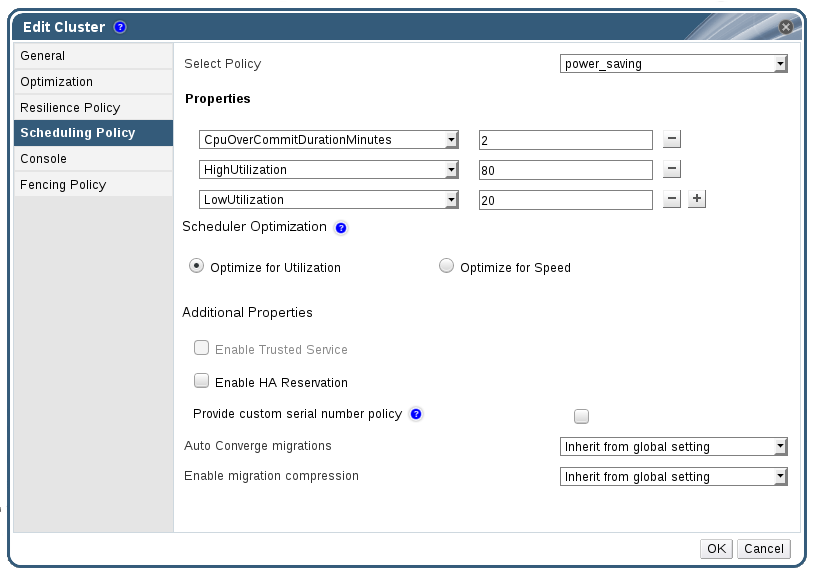

# Setting Load and Power Management Policies for Hosts in a Cluster

The **evenly_distributed** and **power_saving** scheduling policies allow you to specify acceptable memory and CPU usage values, and the point at which virtual machines must be migrated to or from a host. The **vm_evenly_distributed** scheduling policy distributes virtual machines evenly between hosts based on a count of the virtual machines. Define the scheduling policy to enable automatic load balancing across the hosts in a cluster. For a detailed explanation of each scheduling policy, see [Cluster Scheduling Policy Settings](Cluster_Scheduling_Policy_Settings).

**Setting Load and Power Management Policies for Hosts**

1. Use the resource tabs, tree mode, or the search function to find and select the cluster in the results list.

2. Click **Edit** to open the **Edit Cluster** window.

    **Edit Scheduling Policy**

    

3. Select one of the following policies:

    * **none**

    * **vm_evenly_distributed**

        1. Set the maximum number of virtual machines that can run on each host in the **HighVmCount** field.

        2. Define the maximum acceptable difference between the number of virtual machines on the most highly-utilized host and the number of virtual machines on the least-utilized host in the **MigrationThreshold** field.

        3. Define the number of slots for virtual machines to be reserved on SPM hosts in the **SpmVmGrace** field.

    * **evenly_distributed**

        1. Set the time (in minutes) that a host can run a CPU load outside of the defined utilization values before the scheduling policy takes action in the **CpuOverCommitDurationMinutes** field.

        2. Enter the CPU utilization percentage at which virtual machines start migrating to other hosts in the **HighUtilization** field.

        3. Enter the minimum required free memory in MB at which virtual machines start migrating to other hosts in the **MinFreeMemoryForUnderUtilized**.

        4. Enter the maximum required free memory in MB at which virtual machines start migrating to other hosts in the **MaxFreeMemoryForOverUtilized**.

    * **power_saving**

        1. Set the time (in minutes) that a host can run a CPU load outside of the defined utilization values before the scheduling policy takes action in the **CpuOverCommitDurationMinutes** field.

        2. Enter the CPU utilization percentage below which the host will be considered under-utilized in the **LowUtilization** field.

        3. Enter the CPU utilization percentage at which virtual machines start migrating to other hosts in the **HighUtilization** field.

        4. Enter the minimum required free memory in MB at which virtual machines start migrating to other hosts in the **MinFreeMemoryForUnderUtilized**.

        5. Enter the maximum required free memory in MB at which virtual machines start migrating to other hosts in the **MaxFreeMemoryForOverUtilized**.

4. Choose one of the following as the **Scheduler Optimization** for the cluster:

    * Select **Optimize for Utilization** to include weight modules in scheduling to allow best selection.

    * Select **Optimize for Speed** to skip host weighting in cases where there are more than ten pending requests.

5. If you are using an OpenAttestation server to verify your hosts, and have set up the server's details using the `engine-config` tool, select the **Enable Trusted Service** check box.

6. Optionally select the **Enable HA Reservation** check box to enable the Manager to monitor cluster capacity for highly available virtual machines.

7. Optionally select the **Provide custom serial number policy** check box to specify a serial number policy for the virtual machines in the cluster, and then select one of the following options:

    * Select **Host ID** to set the host's UUID as the virtual machine's serial number.

    * Select **Vm ID** to set the virtual machine's UUID as its serial number.

    * Select **Custom serial number**, and then specify a custom serial number in the text field.

8. Click **OK**.
