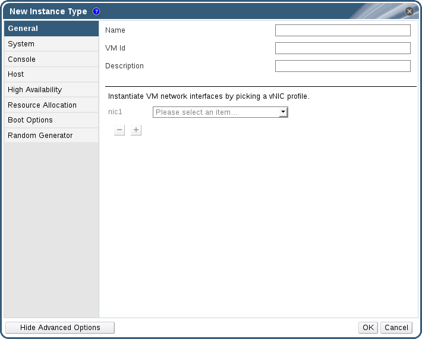

# Creating Instance Types

Administrators can create new instance types, which can then be selected by users when creating or editing virtual machines.

**Creating an Instance Type**

1. On the header bar, click **Configure**.

2. Click the **Instance Types** tab.

3. Click **New** to open the **New Instance Type** window.

    **The New Instance Type Window**

    

4. Enter a **Name** and **Description** for the instance type. 

5. Click **Show Advanced Options** and configure the instance type's settings as required. The settings that appear in the **New Instance Type** window are identical to those in the **New Virtual Machine** window, but with the relevant fields only. See [Explanation of Settings in the New Virtual Machine and Edit Virtual Machine Windows](https://access.redhat.com/documentation/en/red-hat-virtualization/4.0/single/virtual-machine-management-guide/#sect-Explanation_of_Settings_in_the_New_Virtual_Machine_and_Edit_Virtual_Machine_Windows) in the *Virtual Machine Management Guide*.

6. Click **OK**.

The new instance type will appear in the **Instance Types** tab in the **Configure** window, and can be selected from the **Instance Type** drop-down list when creating or editing a virtual machine.

