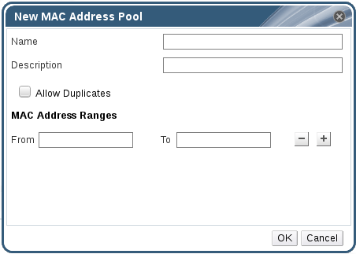

# Creating MAC Address Pools

You can create new MAC address pools. 

**Creating a MAC Address Pool**

1. On the header bar, click the **Configure** button to open the **Configure** window.

2. Click the **MAC Address Pools** tab.

3. Click the **Add** button to open the **New MAC Address Pool** window.

    **The New MAC Address Pool Window**

    

4. Enter the **Name** and **Description** of the new MAC address pool. 

5. Select the **Allow Duplicates** check box to allow a MAC address to be used multiple times in a pool. The MAC address pool will not automatically use a duplicate MAC address, but enabling the duplicates option means a user can manually use a duplicate MAC address. 

    **Note:** If one MAC address pool has duplicates disabled, and another has duplicates enabled, each MAC address can be used once in the pool with duplicates disabled but can be used multiple times in the pool with duplicates enabled.

6. Enter the required **MAC Address Ranges**. To enter multiple ranges click the plus button next to the **From** and **To** fields.

7. Click **OK**.
