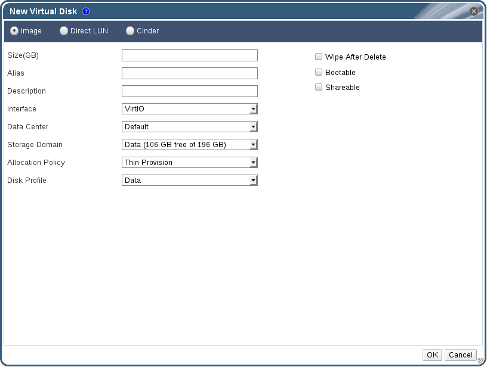

# Creating Floating Virtual Disks

You can create a virtual disk that does not belong to any virtual machines. You can then attach this disk to a single virtual machine, or to multiple virtual machines if the disk is shareable.

**Image** disk creation is managed entirely by the Manager. **Direct LUN** disks require externally prepared targets that already exist. **Cinder** disks require access to an instance of OpenStack Volume that has been added to the Red Hat Virtualization environment using the **External Providers** window; see [Adding an OpenStack Volume Cinder Instance for Storage Management](Adding_an_OpenStack_Volume_Cinder_Instance_for_Storage_Management) for more information.

**Creating Floating Virtual Disks**

1. Select the **Disks** resource tab.

2. Click **New**.

    **Add Virtual Disk Window**

    

3. Use the radio buttons to specify whether the virtual disk will be an **Image**, **Direct LUN**, or **Cinder** disk.

4. Select the options required for your virtual disk. The options change based on the disk type selected. See [Add Virtual Disk dialogue entries](Add_Virtual_Disk_dialogue_entries) for more details on each option for each disk type.

5. Click **OK**.
