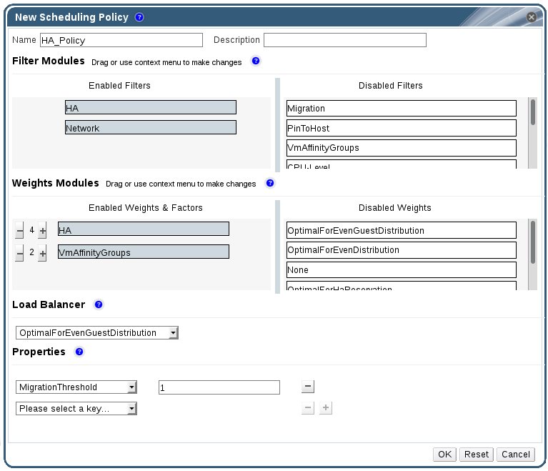

# Creating a Scheduling Policy

You can create new scheduling policies to control the logic by which virtual machines are distributed amongst a given cluster in your Red Hat Virtualization environment.

**Creating a Scheduling Policy**

1. Click the **Configure** button in the header bar of the Administration Portal to open the **Configure** window.

2. Click **Scheduling Policies** to view the scheduling policies tab.

3. Click **New** to open the **New Scheduling Policy** window.

    **The New Scheduling Policy Window**

    

4. Enter a **Name** and **Description** for the scheduling policy.

5. Configure filter modules:

    1. In the **Filter Modules** section, drag and drop the preferred filter modules to apply to the scheduling policy from the **Disabled Filters** section into the **Enabled Filters** section.

    2. Specific filter modules can also be set as the **First**, to be given highest priority, or **Last**, to be given lowest priority, for basic optimization.

        To set the priority, right-click any filter module, hover the cursor over **Position** and select **First** or **Last**.

6. Configure weight modules:

    1. In the **Weights Modules** section, drag and drop the preferred weights modules to apply to the scheduling policy from the **Disabled Weights** section into the **Enabled Weights & Factors** section.

    2. Use the **+** and **-** buttons to the left of the enabled weight modules to increase or decrease the weight of those modules.

7. Specify a load balancing policy:

    1. From the drop-down menu in the **Load Balancer** section, select the load balancing policy to apply to the scheduling policy.

    2. From the drop-down menu in the **Properties** section, select a load balancing property to apply to the scheduling policy and use the text field to the right of that property to specify a value.

    3. Use the **+** and **-** buttons to add or remove additional properties.

8. Click **OK**.
