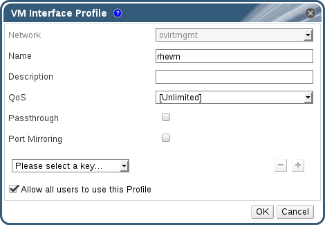

# Creating or Editing a vNIC Profile

Create or edit a Virtual Network Interface Controller (vNIC) profile to regulate network bandwidth for users and groups.

**Note:** If you are enabling or disabling port mirroring, all virtual machines using the associated profile must be in a down state before editing.

**Creating or editing a vNIC Profile**

1. Click the **Networks** resource tab, and select a logical network in the results list.

2. Select the **vNIC Profiles** tab in the details pane. If you selected the logical network in tree mode, you can select the **vNIC Profiles** tab in the results list.

3. Click **New** or **Edit** to open the **VM Interface Profile** window.

    **The VM Interface Profile window**

    

4. Enter the **Name** and **Description** of the profile.

5. Select the relevant Quality of Service policy from the **QoS** list.

6. Select the **Passthrough** check box to enable passthrough of the vNIC and allow direct device assignment of a virtual function. Enabling the passthrough property will disable QoS and port mirroring as these are not compatible. For more information on passthrough, see [Marking vNIC as Passthrough](Marking_vNIC_as_Passthrough).

7. Use the **Port Mirroring** and **Allow all users to use this Profile** check boxes to toggle these options.

8. Select a custom property from the custom properties list, which displays **Please select a key...** by default. Use the **+** and **-** buttons to add or remove custom properties.

9. Click **OK**.

You have created a vNIC profile. Apply this profile to users and groups to regulate their network bandwidth. Note that if you edited a vNIC profile, you must either restart the virtual machine or hot unplug and then hot plug the vNIC.

**Note:** The guest operating system must support vNIC hot plug and hot unplug.
