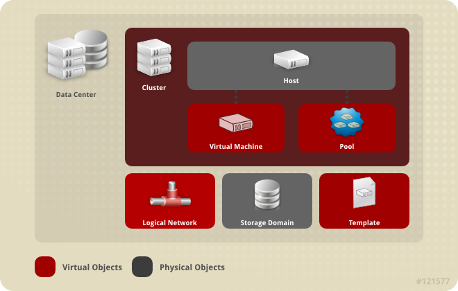

# Introduction to Data Centers

A data center is a logical entity that defines the set of resources used in a specific environment. A data center is considered a container resource, in that it is comprised of logical resources, in the form of clusters and hosts; network resources, in the form of logical networks and physical NICs; and storage resources, in the form of storage domains.

A data center can contain multiple clusters, which can contain multiple hosts; it can have multiple storage domains associated to it; and it can support multiple virtual machines on each of its hosts. A Red Hat Virtualization environment can contain multiple data centers; the data center infrastructure allows you to keep these centers separate.

All data centers are managed from the single Administration Portal.

**Data Centers**

![](images/523.png

Red Hat Virtualization creates a default data center during installation. You can configure the default data center, or set up new appropriately named data centers.

**Data Center Objects**

