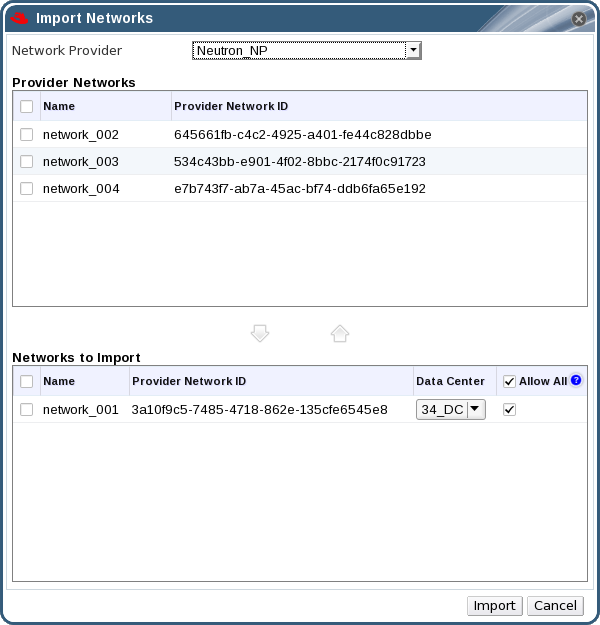

# Importing Networks From External Providers

To use networks from an external network provider (OpenStack Networking or any third-party provider that implements the OpenStack Neutron REST API), register the provider with the Manager. See [Adding an OpenStack Network Service Neutron for Network Provisioning](Adding_an_OpenStack_Network_Service_Neutron_for_Network_Provisioning) or [Adding an External Network Provider](Adding_an_External_Network_Provider) for more information. Then, use the following procedure to import the networks provided by that provider into the Manager so the networks can be used by virtual machines.

**Importing a Network From an External Provider**

1. Click the **Networks** tab.

2. Click the **Import** button to open the **Import Networks** window.

    **The Import Networks Window**

    

3. From the **Network Provider** drop-down list, select an external provider. The networks offered by that provider are automatically discovered and listed in the **Provider Networks** list.

4. Using the check boxes, select the networks to import in the **Provider Networks** list and click the down arrow to move those networks into the **Networks to Import** list.

5. It is possible to customize the name of the network that you are importing. To customize the name, click on the network's name in the **Name** column, and change the text.

6. From the **Data Center** drop-down list, select the data center into which the networks will be imported.

7. Optionally, clear the **Allow All** check box for a network in the **Networks to Import** list to prevent that network from being available to all users.

8. Click the **Import** button.

The selected networks are imported into the target data center and can be attached to virtual machines. See [Adding a New Network Interface](https://access.redhat.com/documentation/en/red-hat-virtualization/4.0/paged/virtual-machine-management-guide/52-network-interfaces) in the *Virtual Machine Management Guide* for more information.

