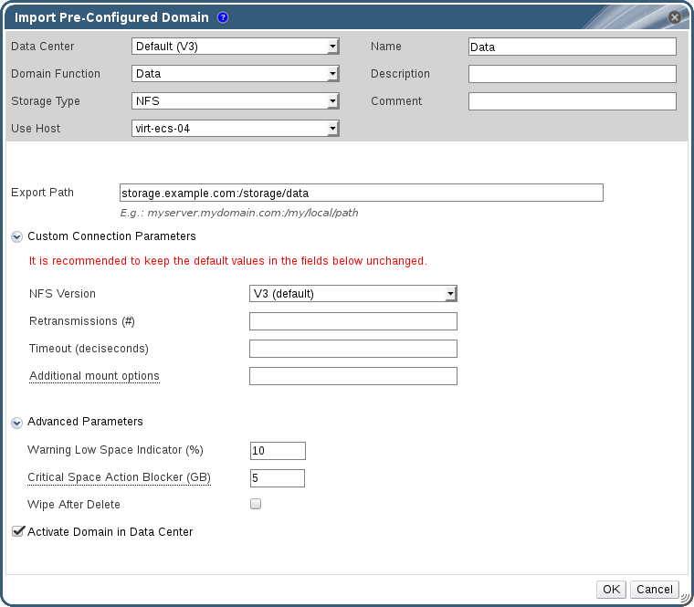

# Importing Storage Domains

Import a storage domain that was previously attached to a data center in the same environment or in a different environment. This procedure assumes the storage domain is no longer attached to any data center in any environment, to avoid data corruption. To import and attach an existing data storage domain to a data center, the target data center must be initialized.

**Importing a Storage Domain**

1. Click the **Storage** resource tab.

2. Click **Import Domain**. 

    **The Import Pre-Configured Domain window**

    

3. Select the data center to which to attach the storage domain from the **Data Center** drop-down list.

4. Enter a name for the storage domain.

5. Select the **Domain Function** and **Storage Type** from the appropriate drop-down lists.

6. Select a host from the **Use host** drop-down list.

    **Important:** All communication to the storage domain is through the selected host and not directly from the Red Hat Virtualization Manager. At least one active host must exist in the system and be attached to the chosen data center. All hosts must have access to the storage device before the storage domain can be configured.

7. Enter the details of the storage domain.

    **Note:** The fields for specifying the details of the storage domain change in accordance with the value you select in the **Domain Function / Storage Type** list. These options are the same as those available for adding a new storage domain. For more information on these options, see [Storage properties](Storage_properties).

8. Select the **Activate Domain in Data Center** check box to activate the storage domain after attaching it to the selected data center.

9. Click **OK**.

The storage domain is imported, and is displayed in the **Storage** tab. You can now import virtual machines and templates from the storage domain to the data center.
