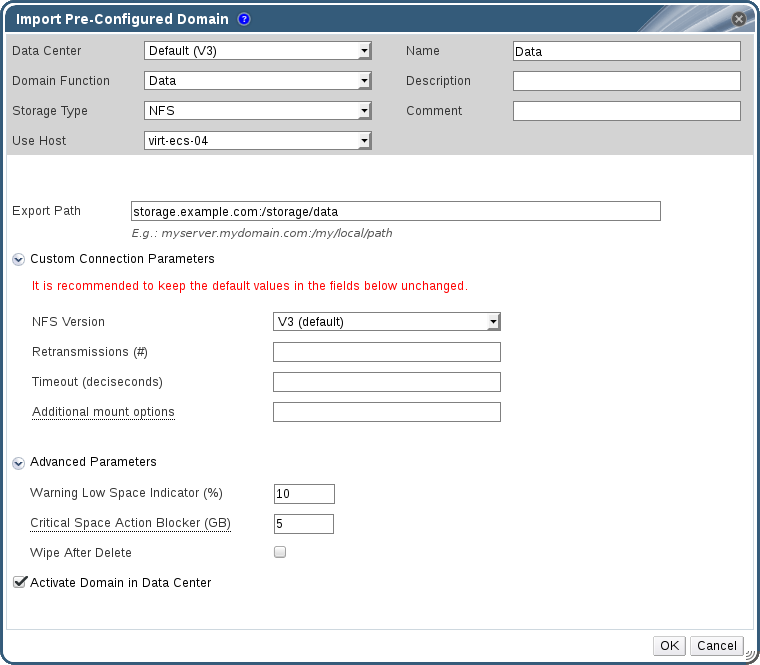

# Migrating Storage Domains between Data Centers in Different Environments

Migrate a storage domain from one Red Hat Virtualization environment to another to allow the destination environment to access the data contained in the storage domain. This procedure involves removing the storage domain from one Red Hat Virtualization environment, and importing it into a different environment. To import and attach an existing data storage domain to a Red Hat Virtualization data center, the storage domain's source data center must have a compatibility level of 3.5 or higher.

**Migrating a Storage Domain between Data Centers in Different Environments**

1. Log in to the Administration Portal of the source environment.

2. Shut down all virtual machines running on the required storage domain.

3. Click the **Storage** resource tab and select the storage domain from the results list.

4. Click the **Data Center** tab in the details pane.

5. Click **Maintenance**, then click **OK** to move the storage domain to maintenance mode.

6. Click **Detach**, then click **OK** to detach the storage domain from the source data center. 

7. Click **Remove**.

8. In the **Remove Storage(s)** window, ensure the **Format Domain, i.e. Storage Content will be lost!** check box is not selected. This step preserves the data in the storage domain for later use.

9. Click **OK** to remove the storage domain from the source environment.

10. Log in to the Administration Portal of the destination environment.

11. Click the **Storage** resource tab.

12. Click **Import Domain**. 

    **The Import Pre-Configured Domain window**

    

13. Select the destination data center from the **Data Center** drop-down list.

14. Enter a name for the storage domain.

15. Select the **Domain Function** and **Storage Type** from the appropriate drop-down lists.

16. Select a host from the **Use Host** drop-down list.

17. Enter the details of the storage domain. 

    **Note:** The fields for specifying the details of the storage domain change in accordance with the value you select in the **Storage Type** drop-down list. These options are the same as those available for adding a new storage domain. For more information on these options, see [Storage properties](Storage_properties).

18. Select the **Activate Domain in Data Center** check box to automatically activate the storage domain when it is attached. 

19. Click **OK**.

The storage domain is attached to the destination data center in the new Red Hat Virtualization environment and is automatically activated. You can now import virtual machines and templates from the imported storage domain to the destination data center. 
