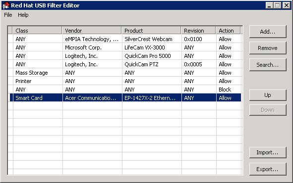
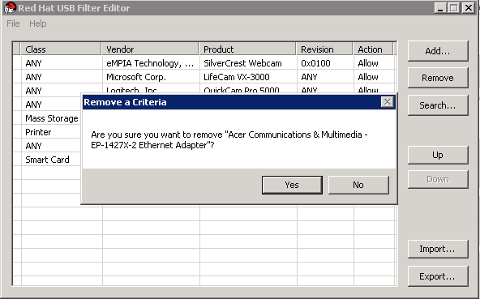

# Removing a USB Policy

**Summary**

Remove a USB policy from the USB Filter Editor.

Double-click the USB Filter Editor shortcut icon on your desktop to open the editor.

**Removing a USB Policy**

1. Select the policy to be removed. 

    **Select USB Policy**

    

2. Click **Remove**. A message displays prompting you to confirm that you want to remove the policy.

    **Edit USB Criteria**

   

3. Click **Yes** to confirm that you want to remove the policy.

4. Click **File** > **Save** to save the changes.

**Result**

You have removed a USB policy from the USB Filter Editor. USB filter policies need to be exported to the Red Hat Virtualization Manager to take effect.
