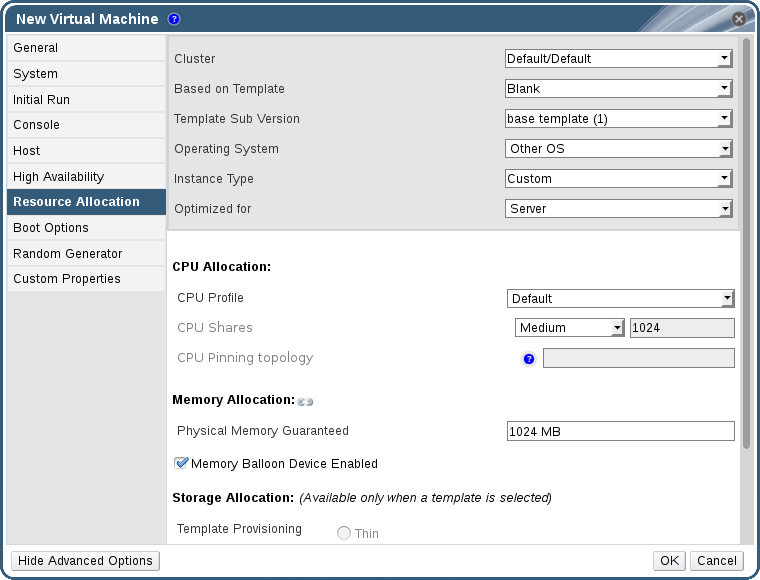

# Service Level Agreement Policy Enforcement

**Summary**

This procedure describes how to set service level agreement CPU features.

**Setting a Service Level Agreement CPU Policy**

1. Select **New VM** in the Navigation Pane.

2. Select **Show Advanced Options**.

3. Select the **Resource Allocation** tab.

    **Service Level Agreement Policy Enforcement - CPU Allocation Menu**

    

4. Specify **CPU Shares**. Possible options are **Low**, **Medium**, **High**, **Custom**, and **Disabled**. Virtual machines set to **High** receive twice as many shares as **Medium**, and virtual machines set to **Medium** receive twice as many shares as virtual machines set to **Low**. **Disabled** instructs VDSM to use an older algorithm for determining share dispensation; usually the number of shares dispensed under these conditions is 1020.

**Result**

You have set a service level agreement CPU policy. The CPU consumption of users is now governed by the policy you have set.
