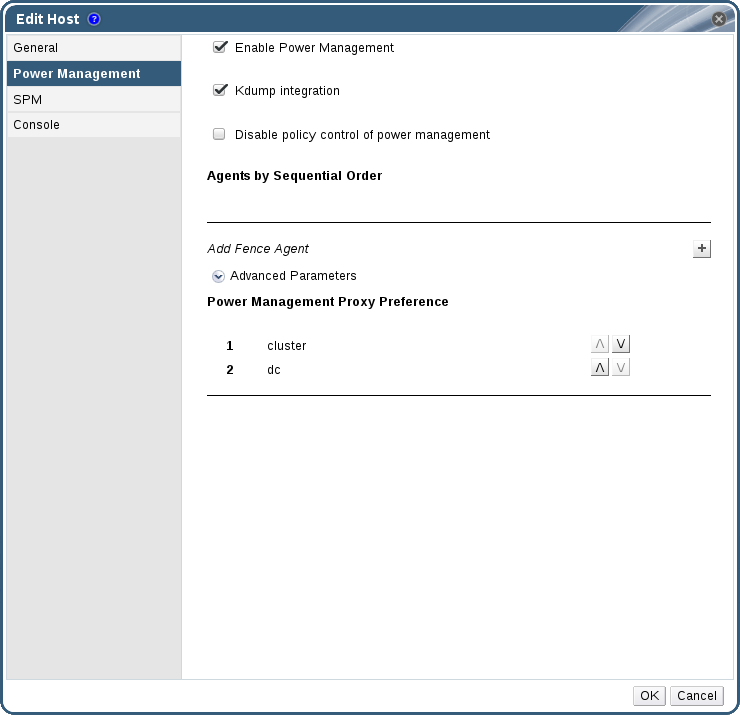
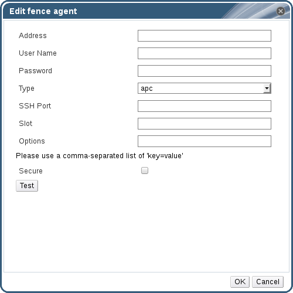

# Setting Fencing Parameters on a Host

The parameters for host fencing are set using the **Power Management** fields on the **New Host** or **Edit Host** windows. Power management enables the system to fence a troublesome host using an additional interface such as a Remote Access Card (RAC).

All power management operations are done using a proxy host, as opposed to directly by the Red Hat Virtualization Manager. At least two hosts are required for power management operations.

**Setting fencing parameters on a host**

1. Use the **Hosts** resource tab, tree mode, or the search function to find and select the host in the results list.

2. Click **Edit** to open the **Edit Host** window.

3. Click the **Power Management** tab.

    **Power Management Settings**

    

4. Select the **Enable Power Management** check box to enable the fields.

5. Select the **Kdump integration** check box to prevent the host from fencing while performing a kernel crash dump.

    **Important:** When you enable **Kdump integration** on an existing host, the host must be reinstalled for kdump to be configured. See [Reinstalling Virtualization Hosts](Reinstalling_Virtualization_Hosts").

6. Optionally, select the **Disable policy control of power management** check box if you do not want your host's power management to be controlled by the **Scheduling Policy** of the host's cluster.

7. Click the plus (**+**) button to add a new power management device. The **Edit fence agent** window opens.

    **Edit fence agent**

    

8. Enter the **Address**, **User Name**, and **Password** of the power management device.

9. Select the power management device **Type** from the drop-down list.

    **Note:** For more information on how to set up a custom power management device, see [https://access.redhat.com/articles/1238743](https://access.redhat.com/articles/1238743).

10. Enter the **SSH Port** number used by the power management device to communicate with the host.

11. Enter the **Slot** number used to identify the blade of the power management device.

12. Enter the **Options** for the power management device. Use a comma-separated list of `'key=value'` entries.

13. Select the **Secure** check box to enable the power management device to connect securely to the host.

14. Click the **Test** button to ensure the settings are correct. *Test Succeeded, Host Status is: on* will display upon successful verification.

    **Warning:** Power management parameters (userid, password, options, etc) are tested by Red Hat Virtualization Manager only during setup and manually after that. If you choose to ignore alerts about incorrect parameters, or if the parameters are changed on the power management hardware without the corresponding change in Red Hat Virtualization Manager, fencing is likely to fail when most needed.

15. Click **OK** to close the **Edit fence agent** window.

16. In the **Power Management** tab, optionally expand the **Advanced Parameters** and use the up and down buttons to specify the order in which the Manager will search the host's **cluster** and **dc** (datacenter) for a fencing proxy.

17. Click **OK**.

You are returned to the list of hosts. Note that the exclamation mark next to the host's name has now disappeared, signifying that power management has been successfully configured.
