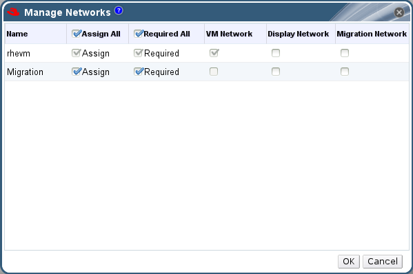

# Designate a Specific Traffic Type for a Logical Network with the Manage Networks Window

Specify the traffic type for the logical network to optimize the network traffic flow.

**Specifying Traffic Types for Logical Networks**

1. Click the **Clusters** resource tab, and select a cluster from the results list.

2. Select the **Logical Networks** tab in the details pane to list the logical networks assigned to the cluster.

3. Click **Manage Networks** to open the **Manage Networks** window.

    **Manage Networks**

    

4. Select appropriate check boxes.

5. Click **OK** to save the changes and close the window.

You have optimized the network traffic flow by assigning a specific type of traffic to be carried on a specific logical network.

**Note:** Logical networks offered by external providers must be used as virtual machine networks; they cannot be assigned special cluster roles such as display or migration.
