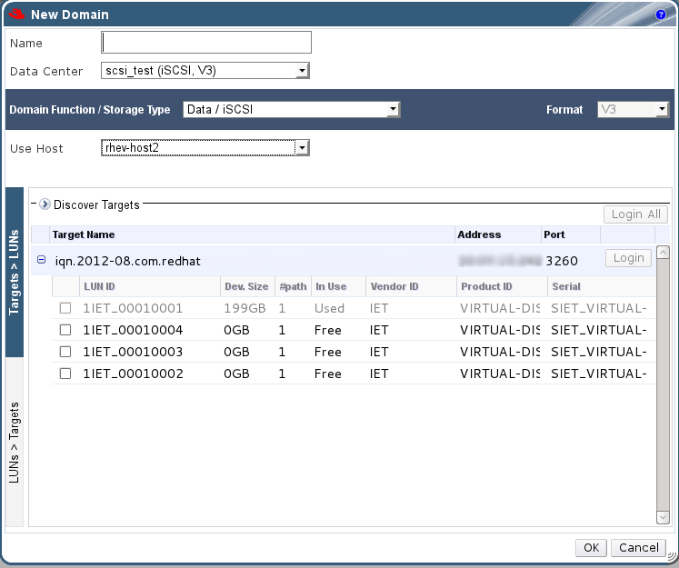

# Unusable LUNs in Red Hat Virtualization

In certain circumstances, the Red Hat Virtualization Manager will not allow you to use a LUN to create a storage domain or virtual machine hard disk.

* LUNs that are already part of the current Red Hat Virtualization environment are automatically prevented from being used. 

    **Unusable LUNs in the Red Hat Virtualization Administration Portal**

    

* LUNs that are already being used by the SPM host will also display as in use. You can choose to forcefully over ride the contents of these LUNs, but the operation is not guaranteed to succeed.
