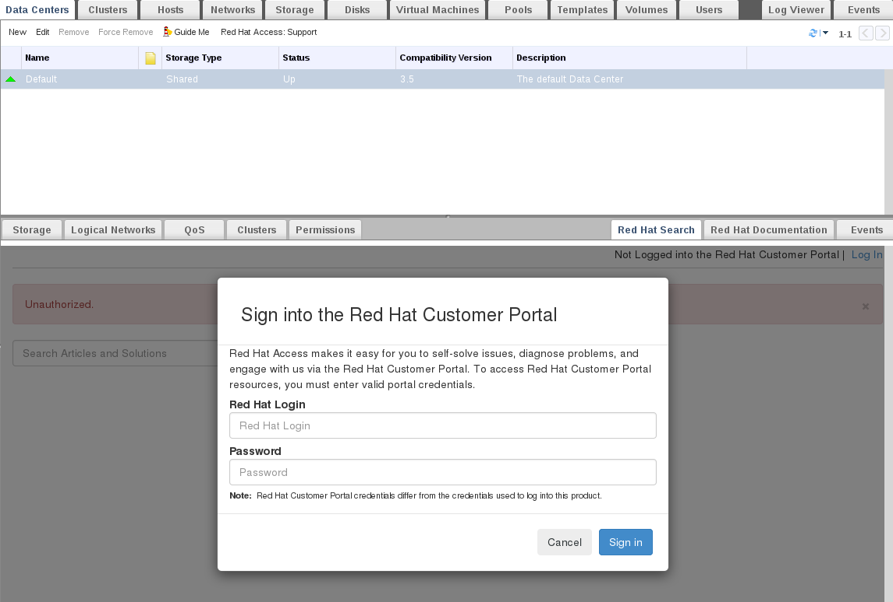
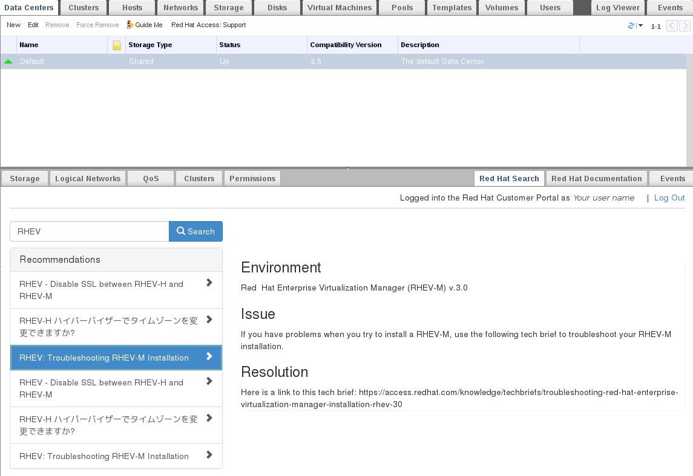
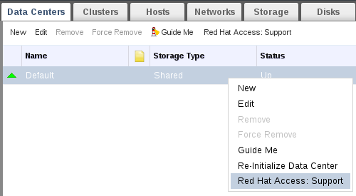
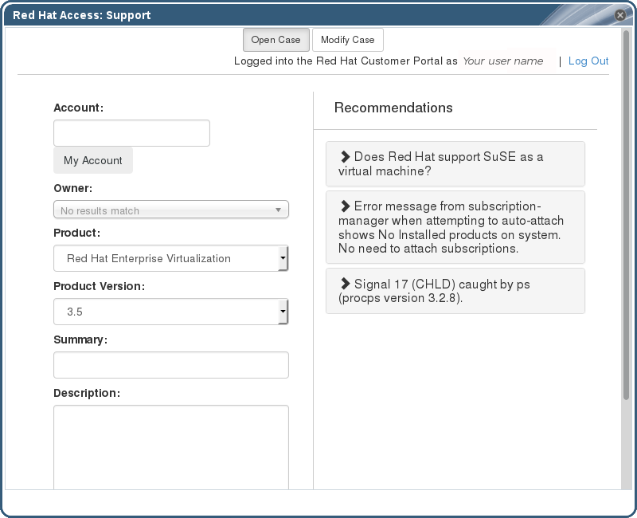
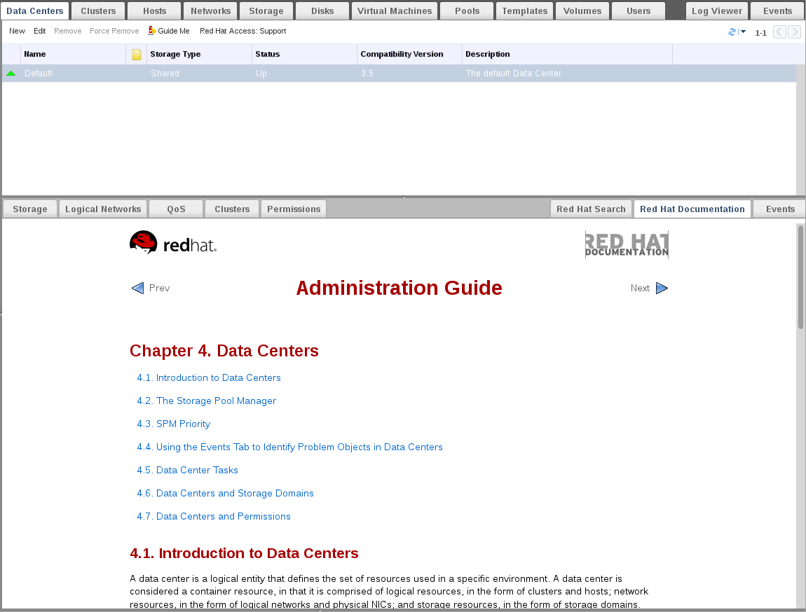

# Using Red Hat Support Plug-in

The Red Hat Access Plug-in allows you to use Red Hat access services from the Red Hat Virtualization Administration Portal. You must log in using your Red Hat login credentials. The Red Hat Access Plug-in detects when you are not logged in; if you are not logged in, a login window opens.

**Note:** Red Hat Virtualization Administration Portal credentials are not the same as a user's Red Hat login.

**Red Hat Support Plug-in - Login Window**

After logging in, you will be able to access the Red Hat Customer Portal. Red Hat Support Plug-in is available in the details pane as well as in several context menus in the Red Hat Virtualization Administration Portal. Search the Red Hat Access database using the Search bar. Search results display in the left-hand navigation list in the details pane.

**Red Hat Support Plug-in - Query Results in the Left-Hand Navigation List**

Right-click on context menus in the Red Hat Virtualization Administrator Portal to access the Red Hat Support Plug-in.

**Right-clicking on a Context Menu to Access Red Hat Support Plug-in**

Open a new support case or modify an existing case by selecting the **Open New Support Case** or **Modify Existing Case** buttons.

**Red Hat Support Plug-in - Opening a New Support Case**

Select the `Red Hat Documentation` tab to open the documentation relevant to the part of the Administration Portal currently on the screen.

**Red Hat Support Plug-in - Accessing Documentation**

