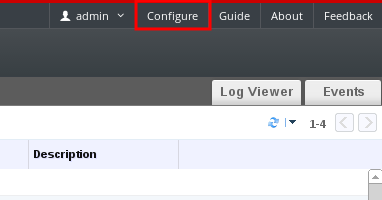
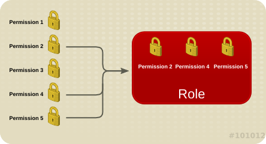
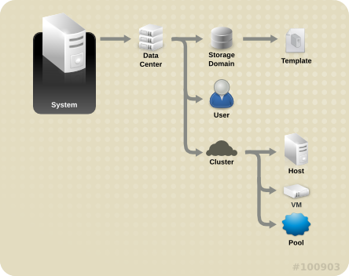
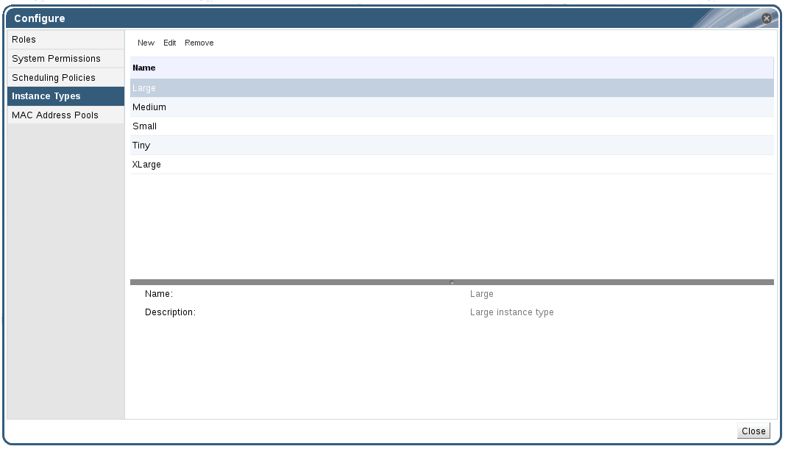

# Global Configuration

Accessed from the header bar in the Administration Portal, the **Configure** window allows you to configure a number of global resources for your Red Hat Virtualization environment, such as users, roles, system permissions, scheduling policies, instance types, and MAC address pools. This window allows you to customize the way in which users interact with resources in the environment, and provides a central location for configuring options that can be applied to multiple clusters.

**Accessing the Configure window**

## Roles

Roles are predefined sets of privileges that can be configured from Red Hat Virtualization Manager. Roles provide access and management permissions to different levels of resources in the data center, and to specific physical and virtual resources.

With multilevel administration, any permissions which apply to a container object also apply to all individual objects within that container. For example, when a host administrator role is assigned to a user on a specific host, the user gains permissions to perform any of the available host operations, but only on the assigned host. However, if the host administrator role is assigned to a user on a data center, the user gains permissions to perform host operations on all hosts within the cluster of the data center.

* [Creating a new role](Creating_a_new_role)
* [Editing a role](Editing_a_role)
* [Authorization examples](Authorization_examples)

# System Permissions

Permissions enable users to perform actions on objects, where objects are either individual objects or container objects.

**Permissions & Roles**

Any permissions that apply to a container object also apply to all members of that container. The following diagram depicts the hierarchy of objects in the system.

**Red Hat Virtualization Object Hierarchy**

* [User properties](User_properties)
* [User properties roles](User_properties_roles)
* [User Roles Explained](User_Roles_Explained)
* [Administrator Roles Explained](Administrator_Roles_Explained)

# Scheduling Policies

A scheduling policy is a set of rules that defines the logic by which virtual machines are distributed amongst hosts in the cluster that scheduling policy is applied to. Scheduling policies determine this logic via a combination of filters, weightings, and a load balancing policy. The Red Hat Virtualization Manager provides five default scheduling policies: **Evenly_Distributed**, **InClusterUpgrade**, **None**, **Power_Saving**, and **VM_Evenly_Distributed**. You can also define new scheduling policies that provide fine-grained control over the distribution of virtual machines.

* [Creating a Scheduling Policy](Creating_a_Scheduling_Policy)
* [Explanation of Settings in the New Scheduling Policy and Edit Scheduling Policy Window](Explanation_of_Settings_in_the_New_Scheduling_Policy_and_Edit_Scheduling_Policy_Window)

# Instance Types

Instance types can be used to define the hardware configuration of a virtual machine. Selecting an instance type when creating or editing a virtual machine will automatically fill in the hardware configuration fields. This allows users to create multiple virtual machines with the same hardware configuration without having to manually fill in every field.

A set of predefined instance types are available by default, as outlined in the following table:

**Predefined Instance Types**

| Name | Memory | vCPUs |
|-
| Tiny | 512 MB | 1 |
| Small | 2 GB | 1 |
| Medium | 4 GB | 2 |
| Large | 8 GB | 2 |
| XLarge | 16 GB | 4 |

Administrators can also create, edit, and remove instance types from the **Instance Types** tab of the **Configure** window.

**The Instance Types Tab**

Fields in the **New Virtual Machine** and **Edit Virtual Machine** windows that are bound to an instance type will have a chain link image next to them (). If the value of one of these fields is changed, the virtual machine will be detached from the instance type, changing to **Custom**, and the chain will appear broken (). However, if the value is changed back, the chain will relink and the instance type will move back to the selected one.

* [Creating Instance Types](Creating_Instance_Types)
* [Editing Instance Types](Editing_Instance_Types)
* [Removing Instance Types](Removing_Instance_Types)

# MAC Address Pools

MAC address pools define the range of MAC addresses from which MAC addresses are allocated for each data center. A MAC address pool is specified for each data center. By using MAC address pools Red Hat Virtualization can automatically generate and assign MAC addresses to new virtual network devices, which helps to prevent MAC address duplication. MAC address pools are more memory efficient when all MAC addresses related to a data center are within the range for the assigned MAC address pool. 

The same MAC address pool can be shared by multiple data centers, but each data center has a single MAC address pool assigned. A default MAC address pool is created by Red Hat Virtualization and is used if another MAC address pool is not assigned. For more information about assigning MAC address pools to data centers see [Creating a New Data Center](Creating_a_New_Data_Center).

The MAC address pool assigns the next available MAC address following the last address that was returned to the pool. If there are no further addresses left in the range, the search starts again from the beginning of the range. If there are multiple MAC address ranges with available MAC addresses defined in a single MAC address pool, the ranges take turns in serving incoming requests in the same way available MAC addresses are selected.

* [Creating MAC Address Pools](Creating_MAC_Address_Pools)
* [Editing MAC Address Pools](Editing_MAC_Address_Pools)
* [Editing MAC Address Pool Permissions](Editing_MAC_Address_Pool_Permissions)
* [Removing MAC Address Pools](Removing_MAC_Address_Pools)
