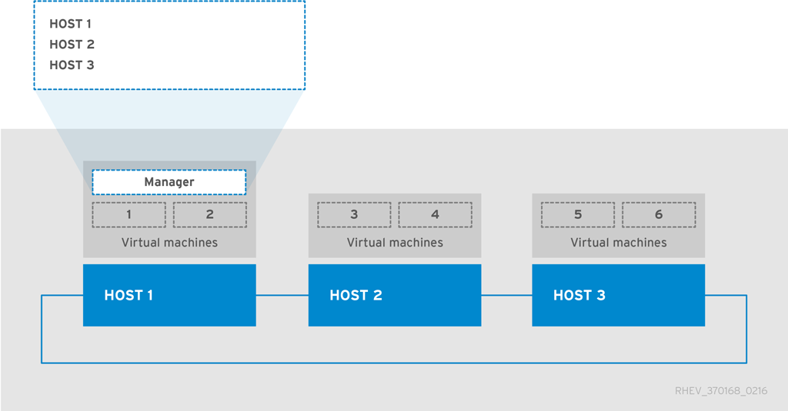

# Backing up and Restoring a RHEL-Based Self-Hosted Environment

The nature of the self-hosted engine, and the relationship between the hosts and the hosted-engine virtual machine, means that backing up and restoring a self-hosted engine environment requires additional considerations to that of a standard Red Hat Virtualization environment. In particular, the hosted-engine hosts remain in the environment at the time of backup, which can result in a failure to synchronize the new host and hosted-engine virtual machine after the environment has been restored.

To address this, it is recommended that one of the hosts be placed into maintenance mode prior to backup, thereby freeing it from a virtual load. This failover host can then be used to deploy the new self-hosted engine.

If a hosted-engine host is carrying a virtual load at the time of backup, then a host with any of the matching identifiers - IP address, FQDN, or name - cannot be used to deploy a restored self-hosted engine. Conflicts in the database will prevent the host from synchronizing with the restored hosted-engine virtual machine. The failover host, however, can be removed from the restored hosted-engine virtual machine prior to synchronization.

**Note:** A failover host at the time of backup is not strictly necessary if a new host is used to deploy the self-hosted engine. The new host must have a unique IP address, FQDN, and name so that it does not conflict with any of the hosts present in the database backup.

**Workflow for Backing Up the Self-Hosted Engine Environment**

This procedure provides an example of the workflow for backing up a self-hosted engine using a failover host. This host can then be used later to deploy the restored self-hosted engine environment. For more information on backing up the self-hosted engine, see [Backing up the Self-Hosted Engine Manager Virtual Machine](Backing_up_the_Self-Hosted_Engine_Manager_Virtual_Machine).

1. The engine virtual machine is running on `Host 2` and the six regular virtual machines in the environment are balanced across the three hosts.

    

    Place `Host 1` into maintenance mode. This will migrate the virtual machines on `Host 1` to the other hosts, freeing it of any virtual load and enabling it to be used as a failover host for the backup.

2. `Host 1` is in maintenance mode. The two virtual machines it previously hosted have been migrated to Host 3.

    

    Use `engine-backup` to create backups of the environment. After the backup has been taken, `Host 1` can be activated again to host virtual machines, including the engine virtual machine.

**Workflow for Restoring the Self-Hosted Engine Environment**

This procedure provides an example of the workflow for restoring the self-hosted engine environment from a backup. The failover host deploys the new engine virtual machine, which then restores the backup. Directly after the backup has been restored, the failover host is still present in the Red Hat Virtualization Manager because it was in the environment when the backup was created. Removing the old failover host from the Manager enables the new host to synchronize with the engine virtual machine and finalize deployment. For more information on restoring the self-hosted engine, see [Restoring SHE bkup](sect-Restoring_SHE_bkup).

1. `Host 1` has been used to deploy a new self-hosted engine and has restored the backup taken in the previous example procedure. Deploying the restored environment involves additional steps to that of a regular self-hosted engine deployment:

    * After Red Hat Virtualization Manager has been installed on the engine virtual machine, but before `engine-setup` is first run, restore the backup using the `engine-backup` tool.

    * After `engine-setup` has configured and restored the Manager, log in to the Administration Portal and remove `Host 1`, which will be present from the backup. If old `Host 1` is not removed, and is still present in the Manager when finalizing deployment on new `Host 1`, the engine virtual machine will not be able to synchronize with new `Host 1` and the deployment will fail. 

    

    After `Host 1` and the engine virtual machine have synchronized and the deployment has been finalized, the environment can be considered operational on a basic level. With only one hosted-engine host, the engine virtual machine is not highly available. However, if necessary, high-priority virtual machines can be started on `Host 1`.

    Any standard RHEL-based hosts - hosts that are present in the environment but are not self-hosted engine hosts - that are operational will become active, and the virtual machines that were active at the time of backup will now be running on these hosts and available in the Manager. 

2. `Host 2` and `Host 3` are not recoverable in their current state. These hosts need to be removed from the environment, and then added again to the environment using the hosted-engine deployment script. For more information on these actions, see [Removing Non-Operational Hosts from a Restored Self-Hosted Engine Environment](Removing_Non-Operational_Hosts_from_a_Restored_Self-Hosted_Engine_Environment) and [Installing Additional Hosts to a Self-Hosted Environment](chap-Installing_Additional_Hosts_to_a_Self-Hosted_Environment).

    

    `Host 2` and `Host 3` have been re-deployed into the restored environment. The environment is now as it was in the first image, before the backup was taken, with the exception that the engine virtual machine is hosted on `Host 1`.

* [Backing up the Self-Hosted Engine Manager Virtual Machine](Backing_up_the_Self-Hosted_Engine_Manager_Virtual_Machine)

## Restoring the Self-Hosted Engine Environment

This section explains how to restore a self-hosted engine environment from a backup on a newly installed host. The supported restore method uses the `engine-backup` tool.

Restoring a self-hosted engine environment involves the following key actions:

1. Create a newly installed Red Hat Enterprise Linux host and run the hosted-engine deployment script.

2. Restore the Red Hat Virtualization Manager configuration settings and database content in the new Manager virtual machine.

3. Remove hosted-engine hosts in a <guilabel>Non Operational</guilabel> state and re-install them into the restored self-hosted engine environment.

**Prerequisites**

* To restore a self-hosted engine environment, you must prepare a newly installed Red Hat Enterprise Linux system on a physical host.

* The operating system version of the new host and Manager must be the same as that of the original host and Manager.

* You must have Red Hat Subscription Manager entitlements for your new environment. For a list of the required repositories, see [Subscribing to the Required Entitlements](https://access.redhat.com/documentation/en/red-hat-virtualization/4.0/single/installation-guide/#Subscribing_to_the_Red_Hat_Enterprise_Virtualization_Manager_Channels_using_Subscription_Manager) in the *Installation Guide*.

* The fully qualified domain name of the new Manager must be the same fully qualified domain name as that of the original Manager. Forward and reverse lookup records must both be set in DNS.

* [Creating a New Self-Hosted Engine Environment to be Used as the Restored Environment](Creating_a_New_Self-Hosted_Engine_Environment_to_be_Used_as_the_Restored_Environment)
* [Restoring the Self-Hosted Engine Manager](Restoring_the_Self-Hosted_Engine_Manager)
* [Restoring the Self-Hosted Engine Manager Manually](Restoring_the_Self-Hosted_Engine_Manager_Manually)
* [Removing Non-Operational Hosts from a Restored Self-Hosted Engine Environment](Removing_Non-Operational_Hosts_from_a_Restored_Self-Hosted_Engine_Environment)
