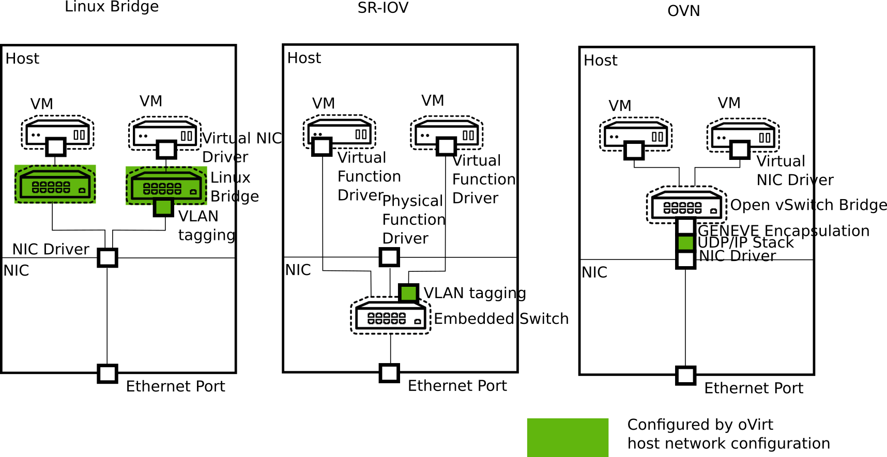

# Overview of Networking in oVirt

## Introduction

This document provides an introductory general view on networking in oVirt, to
enable the reader to dive deeper into details.

## Host Networking

On the data link layer (layer 2), oVirt allows the configuration of Linux bonds,
to connect to VLANs and to define the MTU for network interfaces. These networks
can be shared via Linux bridges to VMs.

For SR-IOV, the number of virtual functions and their mapping to logical
networks can be configured.

There are also VLANs managed by FCoE and (application layer) iSCSI bonds, which
are exclusively for storage access and neither visible for VMs nor in RHVs
network configuration.

On the network layer (layer 3), IP addresses and gateways can be managed.

The DNS resolver used by the host can be configured.

It is also possible to manage network roles and QoS.

## VM Networking

### Supported Networking Types

In oVirt virtual NICs of VMs can connect to:
* Linux bridges
* SR-IOV NICs
* OVN
    - oVirt internal OVN
    - OpenStack Neutron OVN

The following diagram shows the structure of these three approaches:

The following table compares the four kinds of networks:

||Linux bridge|SR-IOV|oVirt internal OVN|OpenStack Neutron OVN|
|--- |--- |--- |--- |--- |
|Isolation from physical host networks|Layer 3, Separate IP network possible|Layer 2, Separate VLANs possible|Isolated|Isolated|
|Live Migration|x|x|x|x|
|QoS|x|||x|
|Port Mirroring|x||||
|Configuration of plugged vNIC|x|x|||
|MAC address management|x|x|x|x|
|MTU propagation|x||x|x|
|VLAN filtering, might require configuration on the physical switch|x|x|Technology Preview|Technology Preview|
|MAC Spoofing Protection|x||x|x|
|IP Spoofing Protection|x||x|x|
|Predefined Network Filters|x||||
|Custom Layer 3/4 Filtering|||x|x|
|NAT||||x|
|DHCP/Router Advertisements|||x|x|
|Layer 3 Router|||x|x|
|Performance|**|***|*|*|
|VM network data encapsulation|flat, VLAN|flat, VLAN|Stable: GENEVE; Technology Preview: flat, VLAN|Stable: GENEVE; Technology Preview: flat, VLAN|

## In which scenario to choose which kind of networking

Linux bridge is the default way to go. It is the most proven option which fits most use cases.

For scenarios that require very low network latency or a high count of Ethernet frames, it might be worth investing in SR-IOV, which requires hardware support and additional configuration steps.

oVirt’s internal OVN networks enable VMs to communicate with each other without additional effort.

If a full-featured SDN is required, OpenStack Neutron can be used to manage OVN.

To utilize the full potential of SDNs, like oVirt internal OVN, OpenStack Neutron OVN, or third party SDN, an additional client like CloudForms is required, because oVirt Engine provides only for a subset of the SDN features an user interface.

All kinds of networks can be combined on a single host and can be connected to the same VM, with a single exception: oVirt’s internal OVN can not be used with Neutron in the same cluster.

### Interaction with the Guest

oVirt supports the initial configuration of the guest by providing configuration data via cloud-init. If the qemu-guest-agent runs inside the guest, oVirt is able to report the IP addresses of the guest.

If the guest VM is using a VirtIO NIC, the MTU of the oVirt logical networks are provided to the guest OS. The guest can pick up the MTU from DHCPv4 or IPv6 router advertisements if supported by the logical network.

### Relation to Host Networking

Linux bridge networking separates VM and host networking on OSI layer 3. This means that the
networking configuration below, like VLAN, bonding, and MTU, is shared between host and VMs.

This implies that hosts should not assign an IP address to VLANs which are connected to VMs
to reduce the surface of the host which might be confused by any VM traffic.

