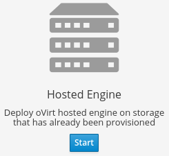

# Download oVirt

oVirt 4.4.9 is intended for production use and is available for the following platforms:

Engine:
- Red Hat Enterprise Linux 8.4
- CentOS Linux 8.4
- CentOS Stream

Hosts:
- Red Hat Enterprise Linux 8.5 beta (or similar)
- oVirt Node (based on CentOS Stream)
- CentOS Stream

See the [Release Notes for oVirt 4.4.9](/release/4.4.9/).

## Install oVirt with Cockpit

oVirt is installed using a graphical installer in Cockpit.

oVirt Engine and a Host are installed together with the Engine running as a Virtual Machine on that Host.
Once you install a second Host, the Engine Virtual Machine will be highly available. See the
[oVirt documentation](/documentation/index.html) for full details.

[Alternate download options](/download/alternate_downloads.html)

oVirt supports two types of [Hosts](/documentation/installing_ovirt_as_a_self-hosted_engine_using_the_cockpit_web_interface/#Installing_Hosts_for_RHV_SHE_cockpit_deploy):

* [oVirt Node](/download/node.html), a minimal hypervisor operating system based on CentOS
* [Enterprise Linux (such as CentOS or RHEL)](/documentation/installing_ovirt_as_a_self-hosted_engine_using_the_cockpit_web_interface/#Red_Hat_Enterprise_Linux_hosts_SHE_cockpit_deploy)

Depending on your environment requirements, you may want to use only oVirt Nodes, only EL Hosts, or both.

#### Download oVirt Node

{:.instructions}
1.  Download the oVirt Node Installation ISO (current stable is [oVirt Node 4.4 - Stable Release - Installation ISO](https://resources.ovirt.org/pub/ovirt-4.4/iso/ovirt-node-ng-installer/))

2.  Write the oVirt Node Installation ISO disk image to a USB, CD, or DVD.

3.  Boot your physical machine from that media and install the oVirt Node minimal operating system.

#### Or Setup a Host

Instead of or in addition to oVirt Node, you can use a standard Enterprise Linux installation as a Host.

{:.instructions}
1.  Install one of the supported operating systems (CentOS, RHEL) on your Host and update it:

        sudo dnf update -y
        # reboot if the kernel was updated

2.  Add the official oVirt repository:

        sudo dnf install https://resources.ovirt.org/pub/yum-repo/ovirt-release44.rpm

## Install oVirt using the Cockpit wizard

{:.instructions}
1.  Enable the Base, Appstream, and Ansible repositories (Red Hat Enterprise Linux only):

        # RHEL only -- they are enabled by default on CentOS and oVirt Node
        sudo subscription-manager repos --enable="rhel-8-for-x86_64-baseos-rpms"
        sudo subscription-manager repos --enable="rhel-8-for-x86_64-appstream-rpms"
        sudo subscription-manager repos --enable="ansible-2-for-rhel-8-x86_64-rpms"

        # RHEL beta releases only
        sudo subscription-manager repos --enable="rhel-8-for-x86_64-baseos-beta-rpms"
        sudo subscription-manager repos --enable="rhel-8-for-x86_64-appstream-beta-rpms"

2.  Install Cockpit and the cockpit-ovirt-dashboard plugin:

        sudo yum install cockpit cockpit-ovirt-dashboard -y

3.  Enable Cockpit:

        sudo systemctl enable --now cockpit.socket

4.  Open the firewall:

        sudo firewall-cmd --add-service=cockpit
        sudo firewall-cmd --add-service=cockpit --permanent

5.  Log in to Cockpit as root at https://\[Host IP or FQDN\]:9090 and click Virtualization → Hosted Engine.

6.  Click Start under the Hosted Engine option.

    

7.  Complete the setup wizard. As part of the setup, you will enter the Hosted Engine's name.

8.  As part of the setup wizard, you will need to provide the location of your storage. oVirt requires a central
    shared storage system for Virtual Machine disk images, ISO files, and snapshots.

9. Once the installation completes, oVirt's web UI management interface will start. Browse to
    https://\[Hosted Engine's name\]/ to begin using oVirt!

    See [Browsers Support](/download/browsers_and_mobile.html) for supported browsers information.

## Setup Additional Hosts

Once the Engine is installed, you must install at least one additional Host for advanced features like migration
and high-availability.

Once you have installed additional oVirt Nodes or EL Hosts, use the oVirt Administration Portal to add them to the Engine.
Navigate to Compute → Hosts → New and enter the Host details. See
[Adding a Host to the oVirt Engine](/documentation/installing_ovirt_as_a_self-hosted_engine_using_the_cockpit_web_interface/#Adding_standard_hosts_to_the_Manager_SHE_cockpit_deploy) for detailed instructions.

## Install Virtual Machines

Once oVirt Engine is installed and you have added Hosts and [configured storage](/documentation/installing_ovirt_as_a_self-hosted_engine_using_the_cockpit_web_interface/#Adding_Storage_Domains_to_RHV_SHE_cockpit_deploy),
you can now install Virtual Machines! See the [Virtual Machine Management Guide](/documentation/virtual_machine_management_guide/)
for complete instructions.

For best Virtual Machine performance and accurate dashboard statistics, be sure to install the
[oVirt Guest Agent and Drivers for Linux](/documentation/virtual_machine_management_guide/#Installing_the_Guest_Agents_and_Drivers_on_Red_Hat_Enterprise_Linux)
\[for [Windows](/documentation/virtual_machine_management_guide/#Installing_the_Guest_Agents_and_Drivers_on_Windows)\]
in each Virtual Machine.

The following virtual machine guest operating systems are supported:

|Operating System|Architecture|SPICE support [1]|
|:---------------|:-----------|:------------|
|Red Hat Enterprise Linux 3 - 6|32-bit, 64-bit|Yes|
|Red Hat Enterprise Linux 7+|64-bit|Yes|
|SUSE Linux Enterprise Server 10+ [2]|32-bit, 64-bit|No|
|Ubuntu 12.04 (Precise Pangolin LTS)+ [3]|32-bit, 64-bit|Yes|
|Windows XP Service Pack 3 and newer|32-bit|Yes|
|Windows 7|32-bit, 64-bit|Yes|
|Windows 8|32-bit, 64-bit|No|
|Windows 10|64-bit|Yes|
|Windows Server 2003 Service Pack 2 and newer|32-bit, 64-bit|Yes|
|Windows Server 2008|32-bit, 64-bit|Yes|
|Windows Server 2008 R2|64-bit|Yes|
|Windows Server 2012 R2|64-bit|No|
|Windows Server 2016|64-bit|No|

[1] SPICE drivers (QXL) are not supplied by Red Hat. Distribution's vendor may provide SPICE drivers. 
[2] select Other Linux for the guest type in the user interface 
[3] not tested recently (?) 

## Consoles

The console is a graphical window that allows you to view and interact with the screen of a Virtual Machine.
In oVirt, you can use a web-based console viewer or a desktop application (we recommend
[Virt Viewer](https://access.redhat.com/documentation/en-us/red_hat_enterprise_linux/8/html/configuring_and_managing_virtualization/getting-started-with-virtualization-in-rhel-8_configuring-and-managing-virtualization#proc_opening-a-virtual-machine-graphical-console-using-virt-viewer_assembly_connecting-to-virtual-machines)).
For Windows virtual machines, Remote Desktop Protocol is also available. See [Installing Console Components](/documentation/virtual_machine_management_guide/#sect-Installing_Console_Components),
[VNC Console Options](/documentation/virtual_machine_management_guide/#VNC_Console_Options), and
and [Browser Support](/download/browsers_and_mobile.html) for more information.

## RPM Repositories and GPG keys

[RPM repository for oVirt 4.4 - Latest stable release](https://resources.ovirt.org/pub/ovirt-4.4/)

See [RPMs and GPG](/download/rpms_and_gpg.html) for older releases, nightlies, mirrors, and GPG keys.
