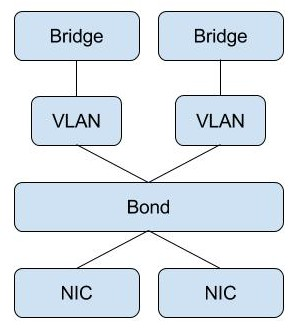
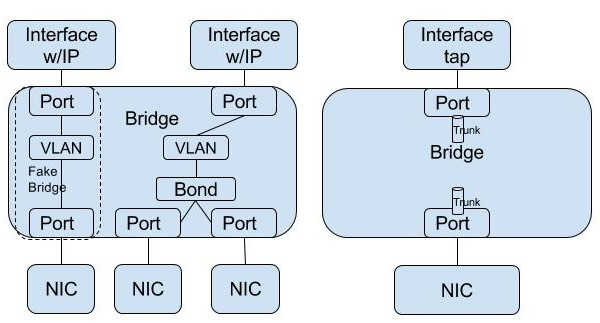
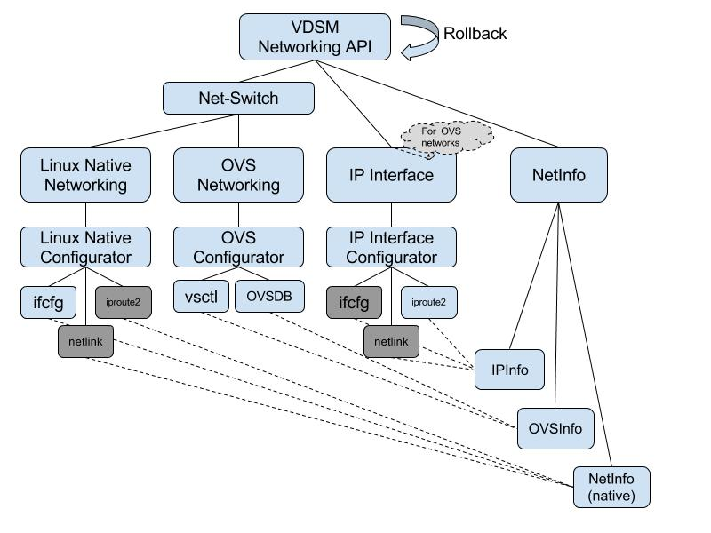

# Native Open vSwitch Spec

## Summary
Open vSwitch (OVS) is a production quality multilayer virtual switch that is widely used in virtualization and dedicated HW environments.
OVS is targeted to replace the native linux networking solutions (mainly the bridge).
The integration of OVS into oVirt has began by introducing a special hook that implements the networking details using OVS.
OVS is to be fully integrated (natively) into oVirt through VDSM, becoming the default networking solution.

## Goals
1. Replace native linux networking entities (e.g. bridge) with OVS on oVirt hosts.
2. Preserve current networking requirements from oVirt hosts.
3. Preserve or increase networking performance.
4. Keep both switching options available, letting end users of ovirt-4.0 decide when they would like to upgrade their existing 3.6 clusters.

## Overview
The introduction of OVS as an additional network switching solution raises the need to generalize and abstract the requirements from the system networking services and define a spec which considers both options (ovs & native linux networking).
The OVS model of arranging networking entities is different from the native linux networking, but is closer to industry networking modeling.

### Network Entities
In the following table, networking entities are listed with their implementation options.

|     Entity       | Kernel |  OVS  |    Remark     |
| :----------------| :----: | :---: | ------------- |
| Interface        |   X    |   X*  | Interfaces may be created by OVS on the kernel and attached to OVS ports. |
| Port/NIC         |   X    |   X   |               |
| Bond             |   X    |   X   | kernel mod    |
| Bridge           |   X    |   X   |               |
| Tagging & Tunneling | X   |   X   |               |
| QoS              |   X    |   X   |               |
| IP routing       |   X    | w/Controller |        |
| TCP/UDP stack    |   X    |   -   |               |

### Linux native networking model

### OVS networking model 

## Specifications

### Solution Diagram

### NetSwitch
A generic switch interface, relaying setup or report requests to the relevant switch implementation (currently two, legacy linux networking and ovs).

This aproach is prefered over having an additional configurator type under the existing switch scheme:

- Adding OVS as a configurator may require changes in the upper common levels, which may introduce instability in existing functionality.
The proposed abstraction level is aimed to leave existing logic isolated from OVS (and vice versa), reducing potential regression and instability.
- Different switches or domains should be decoupled, each having their own underling implementation options allowing full flexability on how they are implemented.
- The modeling of each switch is different, having it seperated reduces complex logic.

Switch implementations are registered per availability, with an identification and a callback. 
setupNetworks requests are expected to arrive from Engine with a switch type ID, based on which the request is forwarded to the switch implementation.

### OVS Configurators
There are at least two ways to configure OVS: Using the command line utilities (i.e ovs-vsctl) and OVSDB protocol python binding. The latter is considered faster.
To allow future optimizations, an abstraction is defined with the command line as its implementation. This adopts similar work done on openstack ovsdb agent.
API Ref: https://review.openstack.org/#/c/143709/20/neutron/agent/ovsdb.py

### IP Interface
Host IP settings are defined on the kernel stack, independent of the network switch type.
Current Linux-native networking implementation mixes between the two. For OVS, we would like to put things in better order: the IP setup actions are to be organized under the same “roof”, implemented using configurators.

### Persistence
OVS persistency is embedded in the switch.
IP settings are not included and may be implemented using the current persistence scheme.
- Note: An alternative may be to use a minimal persistent management settings and zero persistency for all the rest. Nevertheless these changes are out of scope and are to be handled under a zero persistency feature. 

### Rollback
VDSM networking uses rollback to recover from a setup request which faild to complete.
The network API setupNetworks verb has a complex rollback semantics.
In the vdsm api context, a rollback is detected and a command is issued to supervdsm for handling. This function is currently unused, because the ifcfg configurator never triggers it.
Handling the rollback as close as possible to the setupNetworks api implementation seems more reasonable, moving this rollback handler to the network api (currently in supervdsm context) is to be considered.
The OVS rollback is to be integrated into the existing rollback functionality without heavely affecting existing beahaviours:

- OVS configurators should trigger a rollback which is to be handled at the api level (as described above).
- The ifcfg configurator should keep the existing logic, but in addition it should inform the api level of the rollback which it handled.
Moving the handling of the rollback from the ifcfg configurator to the api level should be investigated, simplifying rollback logic.
- The api level should combine both ifcfg and ovs results in terms of the rollback, and issue relevant commands. TBD

### VDSM API
Minimal changes in current API verbs are required:

- setupNetworks: Per network, add a net-switch type.
  - Currently it can have two values: ‘legacy’ and ‘ovs’.
  - If not explicitly set, assume ‘legacy’. (for compatability with Endgine 3.6)
- oVirt currently differentiates between VM (bridged) networks and non-VM networks due to historical performance benefit of non-bridged networks for non-VM payloads (such as storage and migration). This differentiation is moot with OVS, but in order to keep Engine oblivious to the change, Vdsm should lie to it, and report bridged=False for networks that requested it. Dropping the differentiation from Engine should happen in a later stage.

### Upgrade from native to OVS networking
Transition between networking implementation must be supported for the host as a whole. Nevertheless, if the user has defined his own networking configuration which is not controlled by VDSM, it should coexist with VDSM controlled networks.

Mixing between native and OVS controlled networks is not initially supported, therefore, when a network is marked with a different type from the existing, a validation check should make sure that all other networks are marked for the same network type.

The following sequence describes the transition steps @Engine:

- Hosts are upgraded to OVS supported version (4.0).
- When all active hosts in the cluster have been upgraded, mark the cluster as ‘4.0’ where OVS is supported.
- The default network type for the cluster is set to OVS (for new hosts).
- Update individual hosts to transition to OVS: 
(TBD: one or all of the options below should be chosen)
  - The host networking can be changed when no VM/s are connected to it. With this option oVirt must support VM migration between different switch types.
  - The host networking can be changed in-place without the need to migrate the VM/s. With this option, migration between hosts that have different networking types is not needed (but can coexist).

The following sequence describes the transition steps @Host:
- Receive a setupNetworks verb.
- Detect that a network has been marked with a type that is different from the current.
- Validate that all existing networks exist in the command and that all are marked with the same type.
- Tear down the networks.
- Create networks.

### VM Migration
VM migrations may occur between two hosts that have different types of networking. (See upgrade options above)

In order to support such a migration, libvirt migration hooks will be set at the hosts, allowing the target host to update the network source per the existing network type. 

- This libvirt hook is not available on 3.6 hosts, hence we block migration from OVS active host to 3.6 hosts. 
- In order to fallback to a 3.6 host, a two step action needs to take place:
  - Migrate from an OVS host (4.0) to legacy network 4.0 host.
  - Migrate from the legacy network 4.0 host to 3.6 host.
  - Note: One of the drawbacks this method presents is the requirement of at least 3 hosts in the cluster.

### Multi Bridge
Linux native bridges have no vlan awareness. Binding them to a VLAN is done by adding a VLAN interface to one of its ports. This model decoupled a bridge and vlan, allowing two bridges, both not bound to a vlan (or both bound to the same VLAN/s) yet each is isolated from the other.

An OVS bridge has VLANs embedded, its ports may be marked as trunk or as access of a specific vlan (including VLAN 0). In order to have multiple non-vlan (or with the same VLAN) networks, multiple OVS bridges need to be configured.

When a host works with an OVS switch type, VDSM is required to detect the need of multiple OVS bridges and setup the entities to support it.

Multiple OVS bridges are required in this network topology:

- Two or more non-vlan networks, connected to different nics/bonds.
- Two or more identical-vlan networks, connected to different nics/bonds.

### File Structure
Base path: vdsm/lib/vdsm/network/

- netswitch.py
- ovs
  - api.py
  - configurators
    -vsctl.py
    - ovsdb.py
  - validator.py
  - netinfo
- ip
  - api.py
  - configurators
    - iproute2.py
  - ???

### Dev Stages

1. VDSM Network API cleanup: Seperating current switch logic from the api and cleaning up.
2. Introduce a net-switch abstraction layer with the native linux networking implementing it.
3. Create the IP module with iproute2 configurator.
4. Create the OVS module:
  - Normalize/Canonize
  - Validate request
  - ovs-vsctl configurator
  - Optional: OVS python binding configurator

## Detail Design

### Persistence
KernelConfig should be modified to consider OVSInfo on top of native NetInfo.
